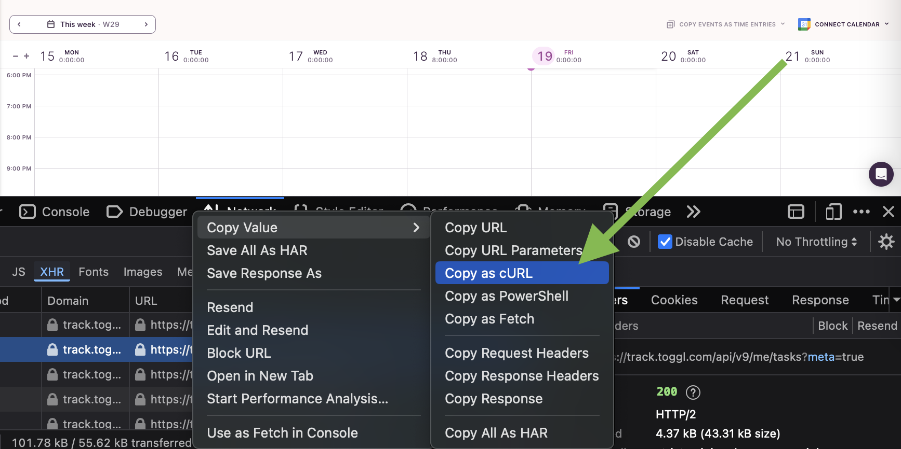

# toggl



Copy as cURL one of your toggl.com http requests.

Paste this into a text field and extract your cookie to a file like:

```
export TOGGL_COOKIE='_gcl_au=ABC123...'
```

Replace (inside the single quotes) the `_gcl_au=ABC123...` stuff with your cookie value.

# building

```
cargo build
cp targets/debug/toggle-cli .
```

# running

```
./toggl-cli
--task=prefix or --desc='desc of what I did'

./toggl-cli --task='project foo'

export TOGGLE_PROJECT_ID=123
export TOGGLE_WORKSPACE_ID=123
export TOGGLE_TASK_ID=123
./toggl-cli --desc='i did a lot for project foo.' --time='2024-07-19 16:00'
```
